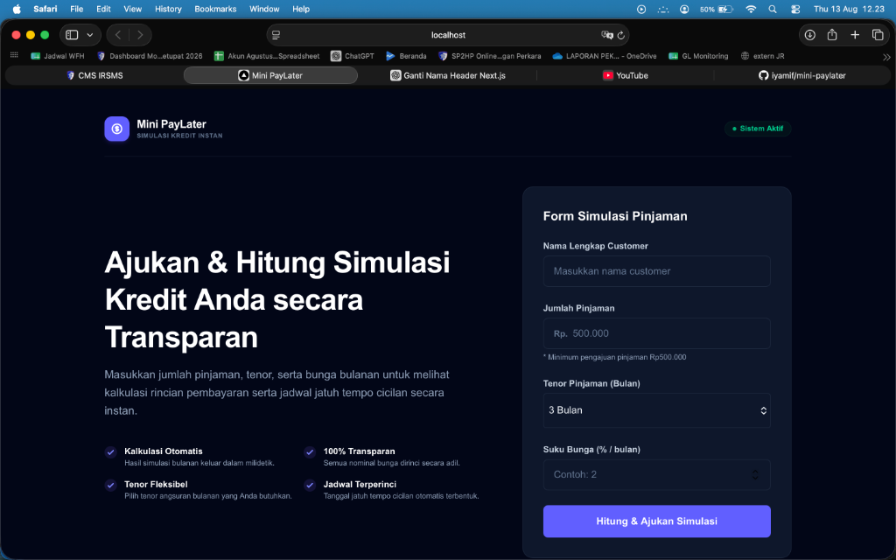
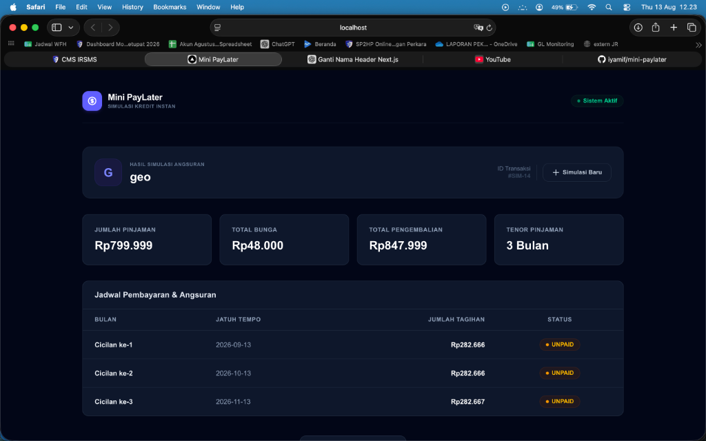
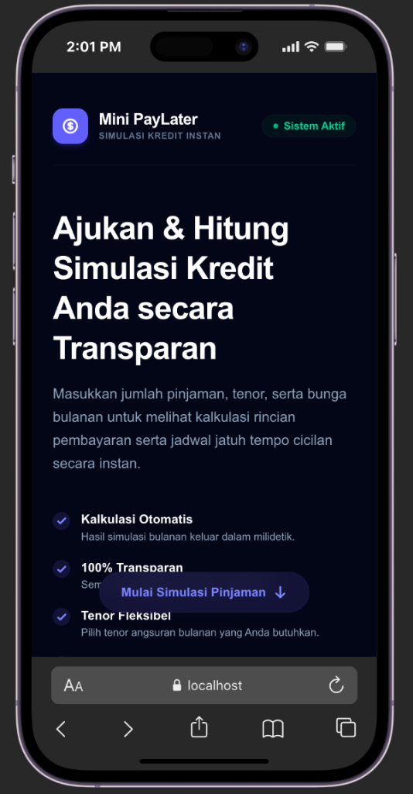
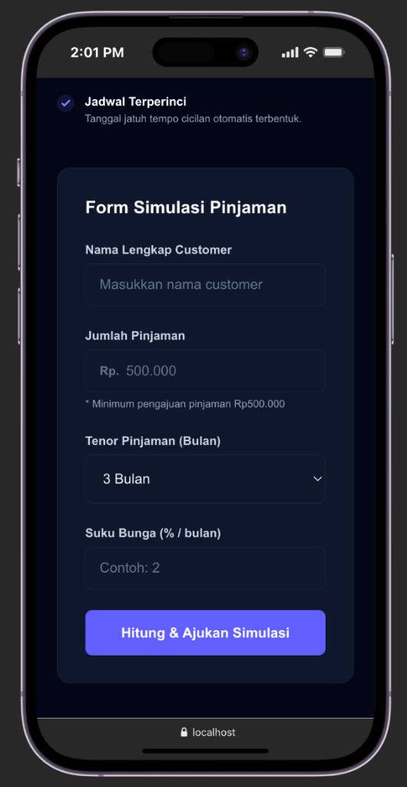
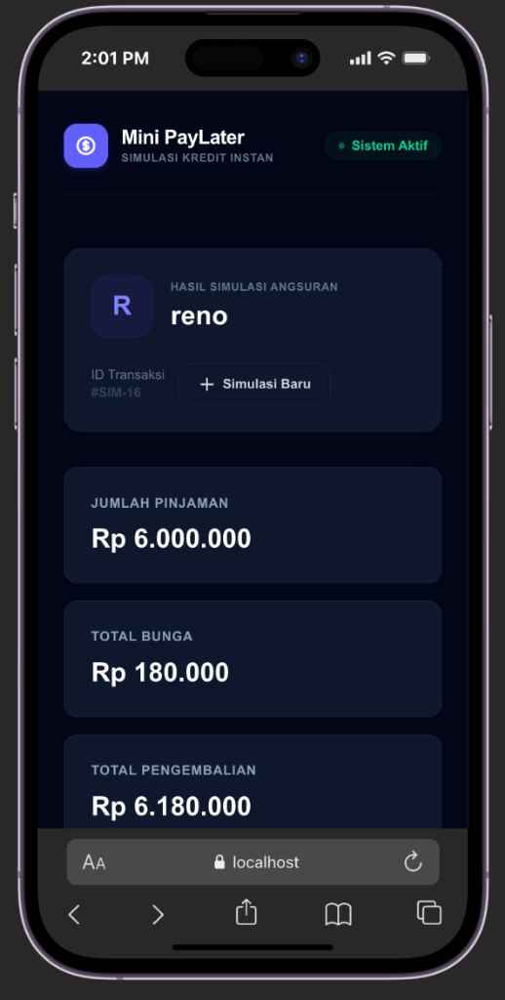

# 💸 Mini PayLater - Simulasi Kredit Instan

Aplikasi web simulasi kredit instan (PayLater) yang memungkinkan pengguna untuk mensimulasikan pinjaman, menghitung bunga, dan melihat jadwal cicilan bulanan beserta tanggal jatuh temponya secara transparan.

🔗 **Live Demo**: [https://mini-paylater.vercel.app](https://mini-paylater.vercel.app)

Proyek ini dibangun menggunakan arsitektur **Monorepo** dengan pemisahan yang jelas antara backend dan frontend:
*   **Backend**: Go (Gin Gonic & GORM)
*   **Frontend**: Next.js (TypeScript & Tailwind CSS)
*   **Database**: PostgreSQL

---

## 📸 Screenshots & Responsive Layout

Aplikasi ini dirancang dengan antarmuka yang sepenuhnya **responsif** (*mobile-friendly*) sehingga dapat menyesuaikan tata letak dengan sempurna baik di layar Desktop maupun Mobile (HP).

### 🖥️ Tampilan Desktop
| Halaman Utama & Form Input | Dashboard Hasil Simulasi & Jadwal |
| :---: | :---: |
|  |  |

### 📱 Tampilan Mobile (Responsif)
*Layout otomatis disesuaikan secara dinamis agar pengguna HP dapat bertransaksi dengan nyaman.*

| 1. Beranda Mobile | 2. Form Input Mobile | 3. Hasil Simulasi Mobile |
| :---: | :---: | :---: |
|  |  |  |

---

## 🛠️ Tech Stack & Prerequisites

Sebelum memulai, pastikan Anda telah menginstal tools berikut di sistem lokal Anda:

### Backend
*   **Go** (Minimal versi `1.25.5`)
*   **PostgreSQL** (Port default `5432` dengan database `mini-paylater`)

### Frontend
*   **Node.js** (Minimal versi `18.x` atau yang terbaru)
*   **npm**, **yarn**, atau **pnpm**

---

## 📂 Struktur Project

```text
mini-paylater/
├── backend/          # RESTful API built with Go (Gin + GORM)
│   ├── config/       # Konfigurasi database & environment
│   ├── handler/      # Controller HTTP handler
│   ├── model/        # Struktur data & tabel DB
│   ├── repository/   # Query Database layer
│   ├── service/      # Logika bisnis simulasi kredit
│   └── main.go       # Entry point backend
│
└── frontend/         # Next.js Client
    ├── app/          # App router pages
    ├── components/   # Komponen UI (Form, Summary, Table)
    └── lib/          # API Client & utils
```

---

## 🚀 Cara Install & Konfigurasi

Ikuti langkah-langkah di bawah ini untuk menjalankan aplikasi secara lokal:

### 1. Persiapan Database
1. Buka PostgreSQL Anda (bisa menggunakan pgAdmin, DBeaver, atau terminal CLI).
2. Buat database baru bernama `mini-paylater`:
   ```sql
   CREATE DATABASE "mini-paylater";
   ```

### 2. Jalankan Backend (Go API Server)
1. Pindah ke direktori backend:
   ```bash
   cd backend
   ```
2. Buat berkas konfigurasi `.env` (atau edit berkas `.env` yang sudah ada) dan sesuaikan dengan kredensial PostgreSQL Anda:
   ```env
   APP_PORT=8080
   DB_HOST=localhost
   DB_PORT=5432
   DB_USER=postgres
   DB_PASSWORD=root
   DB_NAME=mini-paylater
   DB_SSLMODE=disable
   ```
3. Unduh modul dependensi Go:
   ```bash
   go mod tidy
   ```
4. Jalankan server backend:
   ```bash
   go run .
   ```
   *Server backend akan berjalan di `http://localhost:8080` dan secara otomatis akan membuat tabel database yang diperlukan (Auto-Migration).*

### 3. Jalankan Frontend (Next.js App)
1. Buka terminal baru dan pindah ke direktori frontend:
   ```bash
   cd frontend
   ```
2. Buat berkas `.env.local` untuk mengarahkan Next.js ke API server:
   ```env
   NEXT_PUBLIC_API_URL=http://localhost:8080
   ```
3. Instal semua dependensi Node.js:
   ```bash
   npm install
   ```
4. Jalankan aplikasi dalam mode development:
   ```bash
   npm run dev
   ```
   *Aplikasi frontend dapat diakses melalui browser Anda di `http://localhost:3000`.*

---

## 🧪 Cara Pengujian & Testing Aplikasi

Ada beberapa cara untuk melakukan pengujian pada aplikasi ini:

### 1. Pengujian API Backend (Manual via cURL)

Anda dapat menggunakan tool CLI seperti `curl` atau aplikasi REST Client seperti Postman untuk menguji endpoint backend.

#### A. Health Check Endpoint
Memastikan server berjalan dengan baik:
```bash
curl -X GET http://localhost:8080/health
```
**Respon yang diharapkan:**
```json
{
  "status": "OK"
}
```

#### B. Membuat Simulasi Pinjaman Baru (`POST /api/loans`)
Kirim request dengan format JSON berikut untuk membuat simulasi pinjaman:
```bash
curl -X POST http://localhost:8080/api/loans \
  -H "Content-Type: application/json" \
  -d '{
    "customer_name": "Ilham",
    "loan_amount": 5000000,
    "tenor": 6,
    "interest_rate": 2.5
  }'
```
**Respon yang diharapkan:**
```json
{
  "success": true,
  "data": {
    "id": 1,
    "customer_name": "Ilham",
    "loan_amount": 5000000,
    "tenor": 6,
    "interest_rate": 2.5,
    "total_interest": 750000,
    "total_amount": 5750000,
    "created_at": "2026-08-13T13:50:00Z",
    "installments": [
      {
        "id": 1,
        "month_number": 1,
        "due_date": "2026-09-13T13:50:00Z",
        "amount_due": 958333,
        "status": "unpaid"
      },
      ...
    ]
  }
}
```

#### C. Mengambil Detail Simulasi (`GET /api/loans/:id`)
Mengambil simulasi yang sudah disimpan berdasarkan ID:
```bash
curl -X GET http://localhost:8080/api/loans/1
```

### 2. Pengujian Unit Test (Go & Node.js)
*   **Backend Go**:
    Untuk menjalankan pengujian unit test pada backend Go (jika berkas test ditambahkan di masa mendatang):
    ```bash
    cd backend
    go test -v ./...
    ```
*   **Frontend Linter**:
    Untuk melakukan pengecekan kualitas kode frontend (eslint):
    ```bash
    cd frontend
    npm run lint
    ```

### 3. Pengujian UI Frontend (E2E Manual)
1. Buka browser Anda dan arahkan ke `http://localhost:3000`.
2. Di halaman utama, Anda akan disuguhkan **Form Simulasi Pinjaman**.
3. Isi kolom yang disediakan:
   *   **Nama Pelanggan**: Masukkan nama Anda (misal: `Ilham`).
   *   **Jumlah Pinjaman**: Nominal uang yang diajukan (misal: `10000000`).
   *   **Tenor (Bulan)**: Durasi cicilan (misal: `12`).
   *   **Bunga Bulanan (%)**: Persentase bunga bulanan (misal: `1.5`).
4. Klik tombol **Hitung Simulasi**.
5. **Verifikasi Visual**:
   *   Halaman akan secara otomatis menampilkan ringkasan data pinjaman.
   *   Periksa apakah nominal **Total Bunga** dan **Total Pembayaran** sudah sesuai dengan perhitungan matematika.
   *   Periksa **Tabel Rencana Angsuran** untuk memastikan bahwa daftar cicilan bulanan terbentuk sebanyak tenor yang dipilih lengkap dengan tanggal jatuh temponya.
6. Klik tombol **Simulasi Baru** untuk membersihkan form dan membuat kalkulasi baru.

---

## ⚡ Fitur Utama
*   **Kalkulasi Real-time**: Perhitungan nominal cicilan instan dari input formulir.
*   **Skema Jatuh Tempo Otomatis**: Menghitung tanggal jatuh tempo tiap bulan secara berkala dari waktu pengajuan.
*   **Responsive & Modern UI**: Tampilan yang interaktif dengan Dark Mode support, efek glow dekoratif, dan animasi transisi yang mulus.
*   **Arsitektur Clean Code**: Pemisahan layer database, business logic, dan REST handler di sisi backend demi kemudahan scaling dan pemeliharaan.